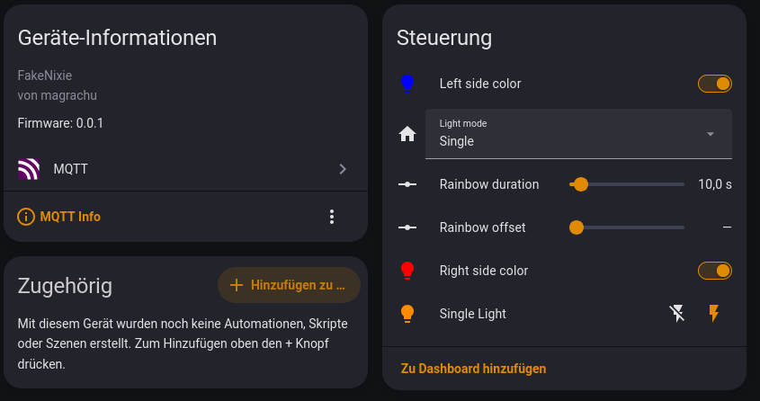
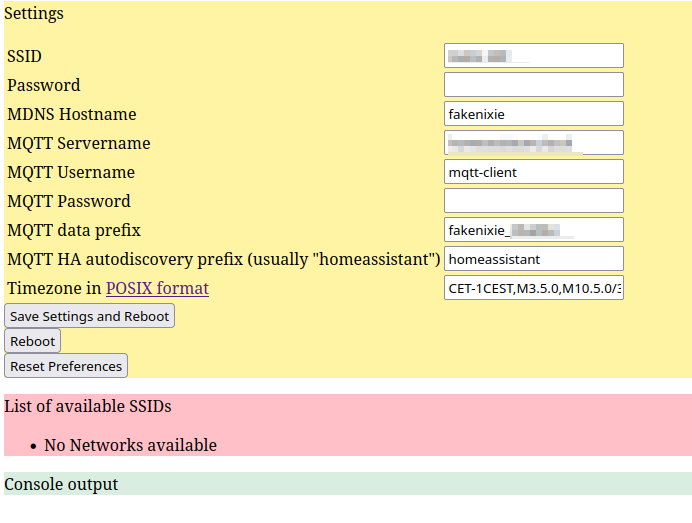

# FakeNix
## Introduction
Control a fake nixie clock in the style of an [Elekstube-R](https://elekstube.com/products/elekstube-r) using an ESP32 controller. Provides wireless networking with pretty basic homeassistant integration using MQTT. You can control color, brightness and color temperature.

The ESP32 RTC is periodically synchronized from an NTP source and adjusted to the timezone. Timezones are defined in [POSIX format](https://github.com/nayarsystems/posix_tz_db/blob/master/zones.csv), so you are also ready for daylight savings time.
As my ESP32 has no battery for the RTC, it needs Wifi to properly work.

## Modifying the original Elekstube-R clock
In order to use it on the original Elekstube-R clock, you need to remove the original AVR controller board and provide your own ESP controller. Basically, you only need one IO pin to drive the WS2812 like LEDs, so nearly any ESP will do. Unfortunately i forgot the pin assignment, but i was pretty straightforward to figure out, as one was ground, one was 5V, one is LED data and one is unused.

### LED power supply
Be aware that the WS2812 LEDs can consume quite a lot of current, and there are 120 of those in this clock.
In normal clock operation, only about 12 are at full power at the same time. I never had any issues with my board. But if you plan to run all the LEDs at the same time, be aware that you need to do some stabilization of your power supply. I was not able to figure out the exact LED model used, i just noticed that they are running the same protocol as the WS2812/NeoPixel.
More info about power consumption [here at adafruit](https://learn.adafruit.com/adafruit-neopixel-uberguide/powering-neopixels).

## Startup
After the first start, a basic Wifi-AP ( with a name "Elekstube-R_" plus a part of its MAC address) is generated. 
To provide some level of safety, a random password suffix is generated on each boot and displayed as digits on the clock itself.
If the clock displays the number "123456", then the ap passcode is "password123456"

A very basic web interface enables you to change preferences and network connections. The credentials are stored in the controller itself in clear text. 
So beware, anyone with physical access could probably read that memory.

There is no support for local operation using the three buttons on the underside.

## Elekstube-R2

The newer Elekstube-R2 model seems to feature a more sophisticated controller board. The LED boards look like they are the same modules as on the -R version. So, if you are privacy concerned, you can still switch out the controller using this project as a base.

## Porting
As this runs on an Arduino Framework, porting to other microcontroller platforms should be rather simple.
